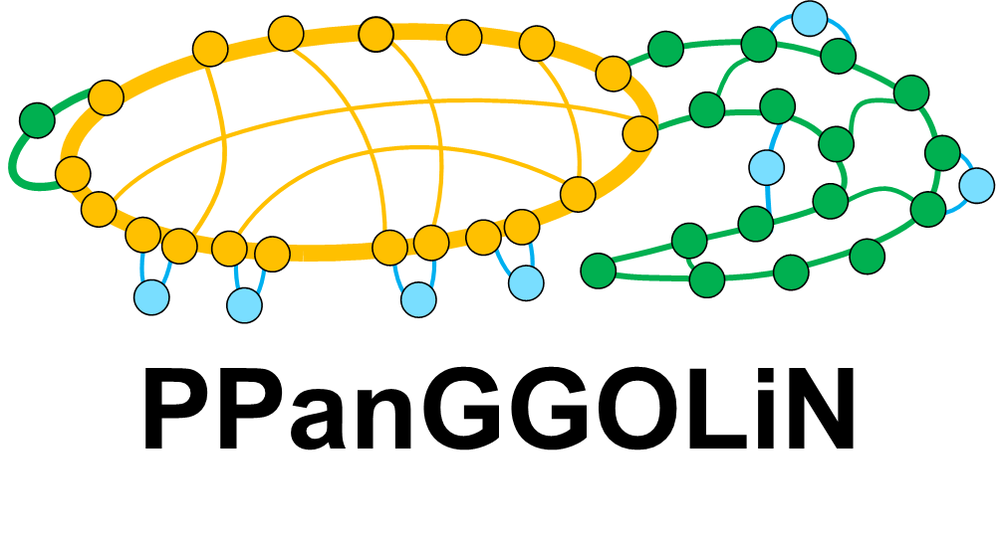
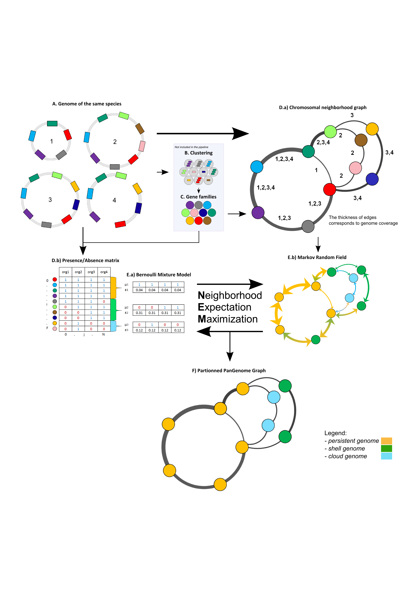

PPanGGOLiN : Depicting microbial species diversity via a Partitioned Pangenome Graph
========================================================

This tools compile the genomic content of a taxonomic unit (pangenome). It is based on a graph approach to model pangenomes in which nodes and edges represent gene families and chromosomal neighborhood information, respectively. This approach takes into account both graph topology and occurrence of genes to classify gene families into three partitions (i.e. *persistent genome*, *shell genome* and *cloud genome*) resulting in what we called Partitioned Pangenome Graph (PPG).The method relies on an Expectation/Maximization algorithm based on Bernoulli Mixture Model coupled with a Markov Random field. Finally, these partitions are projected against the pangenome graph to obtain what we called a Partitioned PanGenome Graph.

Definition:
 1) Persistent genome: equivalent to a relaxed core genome (genes conserved in all but a few genomes);
 2) Shell genome: genes having intermediate frequencies corresponding to moderately conserved genes potentially associated to environmental adaptation capabilities
 3) Cloud genome: genes found at a very low frequency. 

A minimum of 5 genomes is generaly required to perform a pangenomics analysis using the *core genome*/*accessory genome* paradigm. Using the statistical approach presented here, we recommend using at least 15 genomes having genomic variations (and not only genetic ones) to obtain robust results.

Installation
============================

PPanGGOLiN can be easily installed via:

.. code:: bash
	pip install ppanggolin

GCC (>=3.0) will be required, as well as the following python modules : "networkx(>=2.00)", "numpy", "tqdm", "highcharts"

Quick usage
============================

The minimal command is :

.. code:: bash

	ppanggolin --organisms ORGANISMS_FILE --gene_families FAMILIES_FILE -o OUTPUT_DIR

Input formats
----------
The tools required 2 files.

1. A file ORGANISMS_FILE summurizing the information about the about the organisms. 
	This is a tab-delimitated file structured as following:

	1. First colunm is the organism name, it must be unique and can't contain reserved word (see section reserved words).
	2. Second column is the path to the associated gff3 file (can be relative or absolute). In the gff files, sequences of the genomes are not required at all. Only CDS features will be taken in account, each one must contain an *ID* attribute and optionaly *Name* and *product* attributes. 
	3. (optional) Further colunms are the id of the contig in the gff files which are both perfectly assembled and circular. In this case, it is mandatory the provide the size of the contigs in the gff file either by adding a "region" feature to the gff file having a correct id attribute or using a '##sequence-region' pragma (as did in prokka).

	Exemple of ORGANISMS_FILE:
	::
		Escherichia_coli_042__E._coli_1	gff3/ESCO.1017.00091.gff	ESCO.1017.00091.0001	ESCO.1017.00091.0002
		Escherichia_coli_1303__E._coli_1	gff3/ESCO.1017.00171.gff	ESCO.1017.00171.0001	ESCO.1017.00171.0002	ESCO.1017.00171.0003	ESCO.1017.00171.0004
		Escherichia_coli_536__E._coli_1	gff3/ESCO.1017.00005.gff	ESCO.1017.00005.0001
		Escherichia_coli_55989__E._coli_1	gff3/ESCO.1017.00015.gff	ESCO.1017.00015.0001
		Escherichia_coli_ABU_83972__E._coli_1	gff3/ESCO.1017.00092.gff	ESCO.1017.00092.0001	ESCO.1017.00092.0002
		Escherichia_coli_ACN001__E._coli_1	gff3/ESCO.1017.00061.gff	ESCO.1017.00061.0001
		Escherichia_coli_APEC_IMT5155__E._coli_1	gff3/ESCO.1017.00152.gff	ESCO.1017.00152.0001	ESCO.1017.00152.0002	ESCO.1017.00152.0003
		Escherichia_coli_APEC_O1__E._coli_1	gff3/ESCO.1017.00137.gff	ESCO.1017.00137.0001	ESCO.1017.00137.0002	ESCO.1017.00137.0003
		Escherichia_coli_APEC_O78__E._coli_1	gff3/ESCO.1017.00024.gff	ESCO.1017.00024.0001
		Escherichia_coli_ATCC_25922__E._coli_1	gff3/ESCO.1017.00151.gff	ESCO.1017.00151.0001	ESCO.1017.00151.0002
		...

	Exemple of one of the associated gff file (obtained using prokka):
	::
		##gff-version 3
		##sequence-region ESCO.1017.00091.0001 1 5241977
		##sequence-region ESCO.1017.00091.0002 1 113346
		ESCO.1017.00091.0001	Prodigal:2.6	CDS	336	2798	.	+	.	ID=ESCO.1017.00091.b0001_00001;Name=thrA;gene=thrA;inference=similar to AA sequence:UniProtKB:P00561;locus_tag=ESCO.1017.00091.b0001_00001;product=Bifunctional aspartokinase/homoserine dehydrogenase 1
		ESCO.1017.00091.0001	Prodigal:2.6	CDS	2800	3732	.	+	.	ID=ESCO.1017.00091.i0001_00002;eC_number=2.7.1.39;Name=thrB;gene=thrB;inference=similar to AA sequence:UniProtKB:P00547;locus_tag=ESCO.1017.00091.i0001_00002;product=Homoserine kinase
		ESCO.1017.00091.0001	Prodigal:2.6	CDS	3733	5019	.	+	.	ID=ESCO.1017.00091.i0001_00003;eC_number=4.2.3.1;Name=thrC;gene=thrC;inference=similar to AA sequence:UniProtKB:P00934;locus_tag=ESCO.1017.00091.i0001_00003;product=Threonine synthase
		ESCO.1017.00091.0001	Prodigal:2.6	CDS	5233	5529	.	+	.	ID=ESCO.1017.00091.i0001_00004;locus_tag=ESCO.1017.00091.i0001_00004;product=hypothetical protein
		ESCO.1017.00091.0001	Prodigal:2.6	CDS	5687	6289	.	-	.	ID=ESCO.1017.00091.i0001_00005;locus_tag=ESCO.1017.00091.i0001_00005;product=hypothetical protein
		ESCO.1017.00091.0001	Prodigal:2.6	CDS	6514	6687	.	-	.	ID=ESCO.1017.00091.i0001_00006;locus_tag=ESCO.1017.00091.i0001_00006;product=hypothetical protein
		ESCO.1017.00091.0001	Prodigal:2.6	CDS	7118	7894	.	-	.	ID=ESCO.1017.00091.i0001_00007;locus_tag=ESCO.1017.00091.i0001_00007;product=hypothetical protein
		...

2. A file FAMILIES_FILE providing the gene families formated as following. 
	This is a tab-delimitated file.

	1. The first columnn is the gene families name (sometime the name of the median gene)
	2. The futher columnn are the name of the gene id belonging to this families. A gene can't belong to multiple families

	Exemple of a families file:
	::
		1	ESCO.1017.00001.i0001_00047	ESCO.1017.00002.i0001_00053	ESCO.1017.00003.i0001_00052	ESCO.1017.00004.i0001_00047	ESCO.1017.00005.i0001_00048	ESCO.1017.00006.i0001_00053	ESCO.1017.00007.i0001_00052	ESCO.1017.00008.i0001_03750	ESCO.1017.00009.i0001_00047	ESCO.1017.00010.i0001_00047	ESCO.1017.00011.i0001_00052	ESCO.1017.00012.i0001_03643	ESCO.1017.00013.i0001_03593	ESCO.1017.00014.i0001_00050	ESCO.1017.00015.i0001_00048	ESCO.1017.00016.i0001_00047	ESCO.1017.00017.i0001_00053	ESCO.1017.00018.i0001_00038	ESCO.1017.00019.i0001_00051	ESCO.1017.00020.i0001_00051	ESCO.1017.00021.i0001_00048	ESCO.1017.00022.i0001_00047	ESCO.1017.00023.i0001_00049	ESCO.1017.00024.i0001_00735	ESCO.1017.00025.i0001_00040	ESCO.1017.00026.i0001_00048	ESCO.1017.00027.i0001_00047	ESCO.1017.00028.i0001_01224	ESCO.1017.00029.i0001_03729	ESCO.1017.00030.i0001_03859	ESCO.1017.00031.i0001_00620	ESCO.1017.00032.i0001_00627	ESCO.1017.00033.i0001_00637	ESCO.1017.00034.i0001_00050	ESCO.1017.00035.i0001_00047	ESCO.1017.00036.i0001_00047	ESCO.1017.00037.i0001_00047	ESCO.1017.00038.i0001_00047	ESCO.1017.00039.i0001_03494	ESCO.1017.00040.i0001_00279	ESCO.1017.00041.i0001_00052	ESCO.1017.00042.i0001_00052	ESCO.1017.00043.i0001_00047	ESCO.1017.00044.i0001_00047	ESCO.1017.00045.i0001_00765	ESCO.1017.00046.i0001_00756	ESCO.1017.00047.i0001_00764	ESCO.1017.00048.i0001_00765	ESCO.1017.00049.i0001_00822	ESCO.1017.00050.i0001_00763	ESCO.1017.00051.i0001_00766	ESCO.1017.00052.i0001_00822	ESCO.1017.00053.i0001_00047	ESCO.1017.00054.i0001_00051	ESCO.1017.00055.i0001_00047	ESCO.1017.00056.i0001_00047	ESCO.1017.00057.i0001_00047	ESCO.1017.00058.i0001_00047	ESCO.1017.00059.i0001_00047	ESCO.1017.00060.i0001_00052	ESCO.1017.00061.i0001_00052	ESCO.1017.00062.i0001_00047	ESCO.1017.00063.i0001_00047	ESCO.1017.00064.i0001_00047	ESCO.1017.00065.i0001_00051	ESCO.1017.00066.i0001_04368	ESCO.1017.00067.i0001_04371	ESCO.1017.00068.i0001_04369	ESCO.1017.00069.i0001_04242	ESCO.1017.00070.i0001_03265	ESCO.1017.00071.i0001_00052	ESCO.1017.00072.i0001_02745	ESCO.1017.00073.i0001_00772	ESCO.1017.00074.i0001_00774	ESCO.1017.00075.i0001_00622	ESCO.1017.00076.i0001_05069	ESCO.1017.00077.i0001_00052	ESCO.1017.00078.i0001_03627	ESCO.1017.00079.i0001_00767	ESCO.1017.00080.i0001_04013	ESCO.1017.00081.i0001_03408	ESCO.1017.00082.i0001_04825	ESCO.1017.00083.i0001_00047	ESCO.1017.00084.i0001_04180	ESCO.1017.00085.i0001_00053	ESCO.1017.00086.i0001_00050	ESCO.1017.00087.i0001_00051	ESCO.1017.00088.i0001_00050	ESCO.1017.00089.i0001_00053	ESCO.1017.00090.i0001_00051	ESCO.1017.00091.i0001_00055	ESCO.1017.00092.i0001_00051	ESCO.1017.00093.i0001_00050	ESCO.1017.00094.i0001_00048	ESCO.1017.00095.i0001_00052	ESCO.1017.00096.i0001_00047	ESCO.1017.00097.i0001_00768	ESCO.1017.00098.i0001_00774	ESCO.1017.00099.i0001_00053	ESCO.1017.00100.i0001_00054	ESCO.1017.00101.i0001_02441	ESCO.1017.00102.i0001_01197	ESCO.1017.00103.i0001_03712	ESCO.1017.00104.i0001_03915	ESCO.1017.00105.i0001_04058	ESCO.1017.00106.i0001_00052	ESCO.1017.00107.i0001_03883	ESCO.1017.00108.i0001_00047	ESCO.1017.00109.i0001_00047	ESCO.1017.00110.i0001_00052	ESCO.1017.00111.i0001_00052	ESCO.1017.00112.i0001_03779	ESCO.1017.00113.i0001_03530	ESCO.1017.00114.i0001_04415	ESCO.1017.00115.i0001_02640	ESCO.1017.00116.i0001_02854	ESCO.1017.00117.i0001_04675	ESCO.1017.00118.i0001_00052	ESCO.1017.00119.i0001_00051	ESCO.1017.00120.i0001_00053	ESCO.1017.00121.i0001_00048	ESCO.1017.00122.i0001_00053	ESCO.1017.00123.i0001_02649	ESCO.1017.00124.i0001_00084	ESCO.1017.00125.i0001_00708	ESCO.1017.00126.i0001_04565	ESCO.1017.00127.i0001_04548	ESCO.1017.00128.i0001_04614	ESCO.1017.00129.i0001_04564	ESCO.1017.00130.i0001_04555	ESCO.1017.00131.i0001_04613	ESCO.1017.00132.i0001_04544	ESCO.1017.00133.i0001_04600	ESCO.1017.00134.i0001_04596	ESCO.1017.00135.i0001_05121	ESCO.1017.00136.i0001_00052	ESCO.1017.00137.i0001_00050	ESCO.1017.00138.i0001_00053	ESCO.1017.00139.i0001_00049	ESCO.1017.00140.i0001_03887	ESCO.1017.00141.i0001_00048	ESCO.1017.00142.i0001_00048	ESCO.1017.00143.i0001_00051	ESCO.1017.00144.i0001_00052	ESCO.1017.00145.i0001_04318	ESCO.1017.00146.i0001_00052	ESCO.1017.00147.i0001_00055	ESCO.1017.00148.i0001_00055	ESCO.1017.00149.i0001_00052	ESCO.1017.00150.i0001_00052	ESCO.1017.00151.i0001_02558	ESCO.1017.00152.i0001_02857	ESCO.1017.00153.i0001_00050	ESCO.1017.00154.i0001_02854	ESCO.1017.00155.i0001_00052	ESCO.1017.00156.i0001_00564	ESCO.1017.00157.i0001_00052	ESCO.1017.00158.i0001_00053	ESCO.1017.00159.i0001_00053	ESCO.1017.00160.i0001_04406	ESCO.1017.00161.i0001_00052	ESCO.1017.00162.i0001_03910	ESCO.1017.00163.i0001_03179	ESCO.1017.00164.i0001_01542	ESCO.1017.00165.i0001_00048	ESCO.1017.00166.i0001_00052	ESCO.1017.00167.i0001_04244	ESCO.1017.00168.i0001_04266	ESCO.1017.00169.i0001_00054	ESCO.1017.00170.i0001_00050	ESCO.1017.00171.i0001_00047	ESCO.1017.00172.i0001_00048	ESCO.1017.00173.i0001_03823	ESCO.1017.00174.i0001_01302	ESCO.1017.00176.i0001_00052	ESCO.1017.00177.i0001_03204	ESCO.1017.00178.i0001_01987	ESCO.1017.00179.i0001_00051	ESCO.1017.00180.i0001_00049	ESCO.1017.00181.i0001_00051	ESCO.1017.00182.i0001_00055	ESCO.1017.00183.i0001_03498	ESCO.1017.00184.i0001_00054	ESCO.1017.00185.i0001_03853	ESCO.1017.00186.i0001_00049	ESCO.1017.00187.i0001_00049	ESCO.1017.00188.i0001_00051	ESCO.1017.00189.i0001_04109	ESCO.1017.00190.i0001_00053	ESCO.1017.00191.i0001_03546	ESCO.1017.00192.i0001_01381	ESCO.1017.00193.i0001_00049	ESCO.1017.00194.i0001_00048	ESCO.1017.00195.i0001_00052	ESCO.1017.00196.i0001_00052	ESCO.1017.00197.i0001_00052	ESCO.1017.00198.i0001_00049	ESCO.1017.00199.i0001_00904	ESCO.1017.00200.i0001_03596	ESCO.1017.00201.i0001_00844	ESCO.1017.00202.i0001_00050	ESCO.1017.00203.i0002_04611
		2	ESCO.1017.00001.i0001_00054	ESCO.1017.00004.i0001_00054	ESCO.1017.00009.i0001_00054	ESCO.1017.00010.i0001_00054	ESCO.1017.00012.i0001_03636	ESCO.1017.00022.i0001_00054	ESCO.1017.00025.i0001_00047	ESCO.1017.00027.i0001_00054	ESCO.1017.00035.i0001_00054	ESCO.1017.00036.i0001_00054	ESCO.1017.00037.i0001_00054	ESCO.1017.00038.i0001_00054	ESCO.1017.00039.i0001_03487	ESCO.1017.00043.i0001_00054	ESCO.1017.00044.i0001_00054	ESCO.1017.00045.i0001_00772	ESCO.1017.00046.i0001_00763	ESCO.1017.00047.i0001_00771	ESCO.1017.00048.i0001_00772	ESCO.1017.00049.i0001_00829	ESCO.1017.00050.i0001_00770	ESCO.1017.00051.i0001_00773	ESCO.1017.00052.i0001_00829	ESCO.1017.00053.i0001_00054	ESCO.1017.00055.i0001_00054	ESCO.1017.00056.i0001_00054	ESCO.1017.00057.i0001_00054	ESCO.1017.00058.i0001_00054	ESCO.1017.00059.i0001_00054	ESCO.1017.00062.i0001_00054	ESCO.1017.00063.i0001_00054	ESCO.1017.00064.i0001_00054	ESCO.1017.00065.i0001_00058	ESCO.1017.00066.i0001_04361	ESCO.1017.00067.i0001_04364	ESCO.1017.00068.i0001_04362	ESCO.1017.00072.i0001_02752	ESCO.1017.00075.i0001_00615	ESCO.1017.00078.i0001_03620	ESCO.1017.00083.i0001_00054	ESCO.1017.00102.i0001_01204	ESCO.1017.00108.i0001_00054	ESCO.1017.00109.i0001_00054
		3	ESCO.1017.00001.i0001_00075	ESCO.1017.00002.i0001_00083	ESCO.1017.00003.i0001_00078	ESCO.1017.00004.i0001_00075	ESCO.1017.00005.i0001_00076	ESCO.1017.00006.i0001_00079	ESCO.1017.00007.i0001_00078	ESCO.1017.00008.i0001_03724	ESCO.1017.00010.i0001_00075	ESCO.1017.00011.i0001_00078	ESCO.1017.00012.i0001_03614	ESCO.1017.00013.i0001_03567	ESCO.1017.00014.i0001_00077	ESCO.1017.00015.i0001_00074	ESCO.1017.00016.i0001_00073	ESCO.1017.00017.i0001_00083	ESCO.1017.00018.i0001_00068	ESCO.1017.00019.i0001_00079	ESCO.1017.00020.i0001_00079	ESCO.1017.00021.i0001_00074	ESCO.1017.00022.i0001_00076	ESCO.1017.00023.i0001_00076	ESCO.1017.00024.i0001_00761	ESCO.1017.00025.i0001_00068	ESCO.1017.00026.i0001_00074	ESCO.1017.00027.i0001_00075	ESCO.1017.00028.i0001_01198	ESCO.1017.00029.i0001_03703	ESCO.1017.00030.i0001_03833	ESCO.1017.00031.i0001_00647	ESCO.1017.00032.i0001_00654	ESCO.1017.00033.i0001_00665	ESCO.1017.00034.i0001_00078	ESCO.1017.00035.i0001_00075	ESCO.1017.00036.i0001_00073	ESCO.1017.00037.i0001_00075	ESCO.1017.00038.i0001_00075	ESCO.1017.00039.i0001_03466	ESCO.1017.00040.i0001_00308	ESCO.1017.00041.i0001_00078	ESCO.1017.00042.i0001_00078	ESCO.1017.00043.i0001_00075	ESCO.1017.00044.i0001_00075	ESCO.1017.00045.i0001_00793	ESCO.1017.00046.i0001_00784	ESCO.1017.00047.i0001_00792	ESCO.1017.00048.i0001_00793	ESCO.1017.00049.i0001_00850	ESCO.1017.00050.i0001_00791	ESCO.1017.00051.i0001_00794	ESCO.1017.00052.i0001_00850	ESCO.1017.00053.i0001_00076	ESCO.1017.00054.i0001_00078	ESCO.1017.00055.i0001_00075	ESCO.1017.00056.i0001_00075	ESCO.1017.00057.i0001_00075	ESCO.1017.00058.i0001_00076	ESCO.1017.00059.i0001_00076	ESCO.1017.00060.i0001_00078	ESCO.1017.00061.i0001_00079	ESCO.1017.00062.i0001_00076	ESCO.1017.00063.i0001_00076	ESCO.1017.00064.i0001_00076	ESCO.1017.00065.i0001_00079	ESCO.1017.00066.i0001_04340	ESCO.1017.00067.i0001_04343	ESCO.1017.00068.i0001_04341	ESCO.1017.00069.i0001_04268	ESCO.1017.00070.i0001_03235	ESCO.1017.00071.i0001_00078	ESCO.1017.00072.i0001_02773	ESCO.1017.00073.i0001_00798	ESCO.1017.00074.i0001_00800	ESCO.1017.00075.i0001_00596	ESCO.1017.00076.i0001_05042	ESCO.1017.00077.i0001_00079	ESCO.1017.00078.i0001_03598	ESCO.1017.00079.i0001_00793	ESCO.1017.00080.i0001_03986	ESCO.1017.00081.i0001_03435	ESCO.1017.00082.i0001_04799	ESCO.1017.00083.i0001_00076	ESCO.1017.00084.i0001_04153	ESCO.1017.00085.i0001_00081	ESCO.1017.00086.i0001_00080	ESCO.1017.00087.i0001_00077	ESCO.1017.00088.i0001_00077	ESCO.1017.00089.i0001_00080	ESCO.1017.00090.i0001_00078	ESCO.1017.00091.i0001_00083	ESCO.1017.00092.i0001_00078	ESCO.1017.00093.i0001_00077	ESCO.1017.00094.i0001_00074	ESCO.1017.00095.i0001_00079	ESCO.1017.00096.i0001_00074	ESCO.1017.00097.i0001_00794	ESCO.1017.00098.i0001_00800	ESCO.1017.00099.i0001_00080	ESCO.1017.00100.i0001_00081	ESCO.1017.00101.i0001_02415	ESCO.1017.00102.i0001_01225	ESCO.1017.00103.i0001_03685	ESCO.1017.00104.i0001_03888	ESCO.1017.00105.i0001_04088	ESCO.1017.00106.i0001_00082	ESCO.1017.00107.i0001_03856	ESCO.1017.00110.i0001_00082	ESCO.1017.00111.i0001_00082	ESCO.1017.00112.i0001_03806	ESCO.1017.00113.i0001_03557	ESCO.1017.00114.i0001_04385	ESCO.1017.00115.i0001_02666	ESCO.1017.00116.i0001_02881	ESCO.1017.00117.i0001_04648	ESCO.1017.00118.i0001_00079	ESCO.1017.00119.i0001_00078	ESCO.1017.00120.i0001_00079	ESCO.1017.00121.i0001_00074	ESCO.1017.00122.i0001_00079	ESCO.1017.00123.i0001_02622	ESCO.1017.00124.i0001_00114	ESCO.1017.00125.i0001_00735	ESCO.1017.00126.i0001_04538	ESCO.1017.00127.i0001_04521	ESCO.1017.00128.i0001_04587	ESCO.1017.00129.i0001_04537	ESCO.1017.00130.i0001_04528	ESCO.1017.00131.i0001_04586	ESCO.1017.00132.i0001_04517	ESCO.1017.00133.i0001_04573	ESCO.1017.00134.i0001_04569	ESCO.1017.00135.i0001_05094	ESCO.1017.00136.i0001_00079	ESCO.1017.00137.i0001_00078	ESCO.1017.00138.i0001_00080	ESCO.1017.00139.i0001_00079	ESCO.1017.00140.i0001_03861	ESCO.1017.00141.i0001_00074	ESCO.1017.00142.i0001_00074	ESCO.1017.00143.i0001_00078	ESCO.1017.00144.i0001_00082	ESCO.1017.00145.i0001_04292	ESCO.1017.00146.i0001_00081	ESCO.1017.00147.i0001_00083	ESCO.1017.00148.i0001_00083	ESCO.1017.00149.i0001_00081	ESCO.1017.00150.i0001_00079	ESCO.1017.00151.i0001_02586	ESCO.1017.00152.i0001_02885	ESCO.1017.00153.i0001_00077	ESCO.1017.00154.i0001_02880	ESCO.1017.00155.i0001_00079	ESCO.1017.00156.i0001_00590	ESCO.1017.00157.i0001_00082	ESCO.1017.00158.i0001_00085	ESCO.1017.00159.i0001_00083	ESCO.1017.00160.i0001_04436	ESCO.1017.00161.i0001_00079	ESCO.1017.00162.i0001_03884	ESCO.1017.00163.i0001_03206	ESCO.1017.00164.i0001_01572	ESCO.1017.00165.i0001_00075	ESCO.1017.00166.i0001_00079	ESCO.1017.00167.i0001_04218	ESCO.1017.00168.i0001_04240	ESCO.1017.00169.i0001_00080	ESCO.1017.00170.i0001_00076	ESCO.1017.00171.i0001_00074	ESCO.1017.00172.i0001_00074	ESCO.1017.00173.i0001_03796	ESCO.1017.00174.i0001_01277	ESCO.1017.00175.i0001_03868	ESCO.1017.00176.i0001_00082	ESCO.1017.00177.i0001_03230	ESCO.1017.00178.i0001_01960	ESCO.1017.00179.i0001_00079	ESCO.1017.00180.i0001_00075	ESCO.1017.00181.i0001_00078	ESCO.1017.00182.i0001_00083	ESCO.1017.00183.i0001_03528	ESCO.1017.00184.i0001_00080	ESCO.1017.00185.i0001_03827	ESCO.1017.00186.i0001_00075	ESCO.1017.00187.i0001_00075	ESCO.1017.00188.i0001_00078	ESCO.1017.00189.i0001_04082	ESCO.1017.00190.i0001_00083	ESCO.1017.00191.i0001_03573	ESCO.1017.00192.i0001_01355	ESCO.1017.00193.i0001_00076	ESCO.1017.00194.i0001_00074	ESCO.1017.00195.i0001_00082	ESCO.1017.00196.i0001_00085	ESCO.1017.00197.i0001_00078	ESCO.1017.00198.i0001_00076	ESCO.1017.00199.i0001_00874	ESCO.1017.00200.i0001_03570	ESCO.1017.00201.i0001_00870	ESCO.1017.00202.i0001_00077	ESCO.1017.00203.i0002_04638
		4	ESCO.1017.00001.i0001_00079	ESCO.1017.00002.i0001_00087	ESCO.1017.00003.i0001_00082	ESCO.1017.00004.i0001_00079	ESCO.1017.00005.i0001_00080	ESCO.1017.00006.i0001_00083	ESCO.1017.00007.i0001_00082	ESCO.1017.00008.i0001_03720	ESCO.1017.00009.i0001_00060	ESCO.1017.00010.i0001_00079	ESCO.1017.00011.i0001_00082	ESCO.1017.00012.i0001_03610	ESCO.1017.00013.i0001_03563	ESCO.1017.00014.i0001_00081	ESCO.1017.00015.i0001_00078	ESCO.1017.00016.i0001_00077	ESCO.1017.00017.i0001_00087	ESCO.1017.00018.i0001_00072	ESCO.1017.00019.i0001_00083	ESCO.1017.00020.i0001_00083	ESCO.1017.00021.i0001_00078	ESCO.1017.00022.i0001_00080	ESCO.1017.00023.i0001_00080	ESCO.1017.00024.i0001_00765	ESCO.1017.00025.i0001_00072	ESCO.1017.00026.i0001_00078	ESCO.1017.00027.i0001_00079	ESCO.1017.00028.i0001_01194	ESCO.1017.00029.i0001_03699	ESCO.1017.00030.i0001_03829	ESCO.1017.00031.i0001_00652	ESCO.1017.00032.i0001_00659	ESCO.1017.00033.i0001_00670	ESCO.1017.00034.i0001_00082	ESCO.1017.00035.i0001_00079	ESCO.1017.00036.i0001_00077	ESCO.1017.00037.i0001_00079	ESCO.1017.00038.i0001_00079	ESCO.1017.00039.i0001_03462	ESCO.1017.00040.i0001_00312	ESCO.1017.00041.i0001_00082	ESCO.1017.00042.i0001_00082	ESCO.1017.00043.i0001_00079	ESCO.1017.00044.i0001_00079	ESCO.1017.00045.i0001_00797	ESCO.1017.00046.i0001_00788	ESCO.1017.00047.i0001_00796	ESCO.1017.00048.i0001_00797	ESCO.1017.00049.i0001_00854	ESCO.1017.00050.i0001_00795	ESCO.1017.00051.i0001_00798	ESCO.1017.00052.i0001_00854	ESCO.1017.00053.i0001_00080	ESCO.1017.00054.i0001_00082	ESCO.1017.00055.i0001_00079	ESCO.1017.00056.i0001_00079	ESCO.1017.00057.i0001_00079	ESCO.1017.00058.i0001_00080	ESCO.1017.00059.i0001_00080	ESCO.1017.00060.i0001_00082	ESCO.1017.00061.i0001_00083	ESCO.1017.00062.i0001_00080	ESCO.1017.00063.i0001_00080	ESCO.1017.00064.i0001_00080	ESCO.1017.00065.i0001_00083	ESCO.1017.00066.i0001_04336	ESCO.1017.00067.i0001_04339	ESCO.1017.00068.i0001_04337	ESCO.1017.00069.i0001_04272	ESCO.1017.00070.i0001_03231	ESCO.1017.00071.i0001_00082	ESCO.1017.00072.i0001_02777	ESCO.1017.00073.i0001_00802	ESCO.1017.00074.i0001_00804	ESCO.1017.00075.i0001_00592	ESCO.1017.00076.i0001_05038	ESCO.1017.00077.i0001_00083	ESCO.1017.00078.i0001_03594	ESCO.1017.00079.i0001_00797	ESCO.1017.00080.i0001_03982	ESCO.1017.00081.i0001_03439	ESCO.1017.00082.i0001_04795	ESCO.1017.00083.i0001_00080	ESCO.1017.00084.i0001_04149	ESCO.1017.00085.i0001_00085	ESCO.1017.00086.i0001_00084	ESCO.1017.00087.i0001_00081	ESCO.1017.00088.i0001_00081	ESCO.1017.00089.i0001_00084	ESCO.1017.00090.i0001_00082	ESCO.1017.00091.i0001_00087	ESCO.1017.00092.i0001_00082	ESCO.1017.00093.i0001_00081	ESCO.1017.00094.i0001_00078	ESCO.1017.00095.i0001_00083	ESCO.1017.00096.i0001_00078	ESCO.1017.00097.i0001_00798	ESCO.1017.00098.i0001_00804	ESCO.1017.00099.i0001_00084	ESCO.1017.00100.i0001_00085	ESCO.1017.00101.i0001_02411	ESCO.1017.00102.i0001_01229	ESCO.1017.00103.i0001_03681	ESCO.1017.00104.i0001_03884	ESCO.1017.00105.i0001_04092	ESCO.1017.00106.i0001_00086	ESCO.1017.00107.i0001_03852	ESCO.1017.00108.i0001_00060	ESCO.1017.00109.i0001_00060	ESCO.1017.00110.i0001_00086	ESCO.1017.00111.i0001_00087	ESCO.1017.00112.i0001_03810	ESCO.1017.00113.i0001_03561	ESCO.1017.00114.i0001_04381	ESCO.1017.00115.i0001_02670	ESCO.1017.00116.i0001_02885	ESCO.1017.00117.i0001_04644	ESCO.1017.00118.i0001_00083	ESCO.1017.00119.i0001_00082	ESCO.1017.00120.i0001_00083	ESCO.1017.00121.i0001_00078	ESCO.1017.00122.i0001_00083	ESCO.1017.00123.i0001_02618	ESCO.1017.00124.i0001_00118	ESCO.1017.00125.i0001_00739	ESCO.1017.00126.i0001_04534	ESCO.1017.00127.i0001_04517	ESCO.1017.00128.i0001_04583	ESCO.1017.00129.i0001_04533	ESCO.1017.00130.i0001_04524	ESCO.1017.00131.i0001_04582	ESCO.1017.00132.i0001_04513	ESCO.1017.00133.i0001_04569	ESCO.1017.00134.i0001_04565	ESCO.1017.00135.i0001_05090	ESCO.1017.00136.i0001_00083	ESCO.1017.00137.i0001_00082	ESCO.1017.00138.i0001_00084	ESCO.1017.00139.i0001_00083	ESCO.1017.00140.i0001_03857	ESCO.1017.00141.i0001_00078	ESCO.1017.00142.i0001_00078	ESCO.1017.00143.i0001_00082	ESCO.1017.00144.i0001_00086	ESCO.1017.00145.i0001_04288	ESCO.1017.00146.i0001_00085	ESCO.1017.00147.i0001_00087	ESCO.1017.00148.i0001_00087	ESCO.1017.00149.i0001_00085	ESCO.1017.00150.i0001_00084	ESCO.1017.00151.i0001_02590	ESCO.1017.00152.i0001_02889	ESCO.1017.00153.i0001_00081	ESCO.1017.00154.i0001_02884	ESCO.1017.00155.i0001_00083	ESCO.1017.00156.i0001_00594	ESCO.1017.00157.i0001_00086	ESCO.1017.00158.i0001_00089	ESCO.1017.00159.i0001_00087	ESCO.1017.00160.i0001_04441	ESCO.1017.00161.i0001_00083	ESCO.1017.00162.i0001_03880	ESCO.1017.00163.i0001_03210	ESCO.1017.00164.i0001_01576	ESCO.1017.00165.i0001_00079	ESCO.1017.00166.i0001_00083	ESCO.1017.00167.i0001_04214	ESCO.1017.00168.i0001_04236	ESCO.1017.00169.i0001_00084	ESCO.1017.00170.i0001_00080	ESCO.1017.00171.i0001_00078	ESCO.1017.00172.i0001_00078	ESCO.1017.00173.i0001_03792	ESCO.1017.00174.i0001_01273	ESCO.1017.00175.i0001_03864	ESCO.1017.00176.i0001_00086	ESCO.1017.00177.i0001_03234	ESCO.1017.00178.i0001_01956	ESCO.1017.00179.i0001_00083	ESCO.1017.00180.i0001_00079	ESCO.1017.00181.i0001_00082	ESCO.1017.00182.i0001_00087	ESCO.1017.00183.i0001_03532	ESCO.1017.00184.i0001_00084	ESCO.1017.00185.i0001_03823	ESCO.1017.00186.i0001_00079	ESCO.1017.00187.i0001_00079	ESCO.1017.00188.i0001_00082	ESCO.1017.00189.i0001_04078	ESCO.1017.00190.i0001_00087	ESCO.1017.00191.i0001_03577	ESCO.1017.00192.i0001_01351	ESCO.1017.00193.i0001_00080	ESCO.1017.00194.i0001_00078	ESCO.1017.00195.i0001_00086	ESCO.1017.00196.i0001_00089	ESCO.1017.00197.i0001_00082	ESCO.1017.00198.i0001_00080	ESCO.1017.00199.i0001_00870	ESCO.1017.00200.i0001_03566	ESCO.1017.00201.i0001_00874	ESCO.1017.00202.i0001_00081	ESCO.1017.00203.i0002_04642
		5	ESCO.1017.00001.i0001_00080	ESCO.1017.00002.i0001_00088	ESCO.1017.00003.i0001_00083	ESCO.1017.00004.i0001_00080	ESCO.1017.00005.i0001_00081	ESCO.1017.00006.i0001_00084	ESCO.1017.00007.i0001_00083	ESCO.1017.00008.i0001_03719	ESCO.1017.00009.i0001_00061	ESCO.1017.00010.i0001_00080	ESCO.1017.00011.i0001_00083	ESCO.1017.00012.i0001_03609	ESCO.1017.00013.i0001_03562	ESCO.1017.00014.i0001_00082	ESCO.1017.00015.i0001_00079	ESCO.1017.00016.i0001_00078	ESCO.1017.00017.i0001_00088	ESCO.1017.00018.i0001_00073	ESCO.1017.00019.i0001_00084	ESCO.1017.00020.i0001_00084	ESCO.1017.00021.i0001_00079	ESCO.1017.00022.i0001_00081	ESCO.1017.00023.i0001_00081	ESCO.1017.00024.i0001_00766	ESCO.1017.00025.i0001_00073	ESCO.1017.00026.i0001_00079	ESCO.1017.00027.i0001_00080	ESCO.1017.00028.i0001_01193	ESCO.1017.00029.i0001_03698	ESCO.1017.00030.i0001_03828	ESCO.1017.00031.i0001_00653	ESCO.1017.00032.i0001_00660	ESCO.1017.00033.i0001_00671	ESCO.1017.00034.i0001_00083	ESCO.1017.00035.i0001_00080	ESCO.1017.00036.i0001_00078	ESCO.1017.00037.i0001_00080	ESCO.1017.00038.i0001_00080	ESCO.1017.00039.i0001_03461	ESCO.1017.00040.i0001_00313	ESCO.1017.00041.i0001_00083	ESCO.1017.00042.i0001_00083	ESCO.1017.00043.i0001_00080	ESCO.1017.00044.i0001_00080	ESCO.1017.00045.i0001_00798	ESCO.1017.00046.i0001_00789	ESCO.1017.00047.i0001_00797	ESCO.1017.00048.i0001_00798	ESCO.1017.00049.i0001_00855	ESCO.1017.00050.i0001_00796	ESCO.1017.00051.i0001_00799	ESCO.1017.00052.i0001_00855	ESCO.1017.00053.i0001_00081	ESCO.1017.00054.i0001_00083	ESCO.1017.00055.i0001_00080	ESCO.1017.00056.i0001_00080	ESCO.1017.00057.i0001_00080	ESCO.1017.00058.i0001_00081	ESCO.1017.00059.i0001_00081	ESCO.1017.00060.i0001_00083	ESCO.1017.00061.i0001_00084	ESCO.1017.00062.i0001_00081	ESCO.1017.00063.i0001_00081	ESCO.1017.00064.i0001_00081	ESCO.1017.00065.i0001_00084	ESCO.1017.00066.i0001_04335	ESCO.1017.00067.i0001_04338	ESCO.1017.00068.i0001_04336	ESCO.1017.00069.i0001_04273	ESCO.1017.00070.i0001_03230	ESCO.1017.00071.i0001_00083	ESCO.1017.00072.i0001_02778	ESCO.1017.00073.i0001_00803	ESCO.1017.00074.i0001_00805	ESCO.1017.00075.i0001_00591	ESCO.1017.00076.i0001_05037	ESCO.1017.00077.i0001_00084	ESCO.1017.00078.i0001_03593	ESCO.1017.00079.i0001_00798	ESCO.1017.00080.i0001_03981	ESCO.1017.00081.i0001_03440	ESCO.1017.00082.i0001_04794	ESCO.1017.00083.i0001_00081	ESCO.1017.00084.i0001_04148	ESCO.1017.00085.i0001_00086	ESCO.1017.00086.i0001_00085	ESCO.1017.00087.i0001_00082	ESCO.1017.00088.i0001_00082	ESCO.1017.00089.i0001_00085	ESCO.1017.00090.i0001_00083	ESCO.1017.00091.i0001_00088	ESCO.1017.00092.i0001_00083	ESCO.1017.00093.i0001_00082	ESCO.1017.00094.i0001_00079	ESCO.1017.00095.i0001_00084	ESCO.1017.00096.i0001_00079	ESCO.1017.00097.i0001_00799	ESCO.1017.00098.i0001_00805	ESCO.1017.00099.i0001_00085	ESCO.1017.00100.i0001_00086	ESCO.1017.00101.i0001_02410	ESCO.1017.00102.i0001_01230	ESCO.1017.00103.i0001_03680	ESCO.1017.00104.i0001_03883	ESCO.1017.00105.i0001_04093	ESCO.1017.00106.i0001_00087	ESCO.1017.00107.i0001_03851	ESCO.1017.00108.i0001_00061	ESCO.1017.00109.i0001_00061	ESCO.1017.00110.i0001_00087	ESCO.1017.00111.i0001_00088	ESCO.1017.00112.i0001_03811	ESCO.1017.00113.i0001_03562	ESCO.1017.00114.i0001_04380	ESCO.1017.00115.i0001_02671	ESCO.1017.00116.i0001_02886	ESCO.1017.00117.i0001_04643	ESCO.1017.00118.i0001_00084	ESCO.1017.00119.i0001_00083	ESCO.1017.00120.i0001_00084	ESCO.1017.00121.i0001_00079	ESCO.1017.00122.i0001_00084	ESCO.1017.00123.i0001_02617	ESCO.1017.00124.i0001_00119	ESCO.1017.00125.i0001_00740	ESCO.1017.00126.i0001_04533	ESCO.1017.00127.i0001_04516	ESCO.1017.00128.i0001_04582	ESCO.1017.00129.i0001_04532	ESCO.1017.00130.i0001_04523	ESCO.1017.00131.i0001_04581	ESCO.1017.00132.i0001_04512	ESCO.1017.00133.i0001_04568	ESCO.1017.00134.i0001_04564	ESCO.1017.00135.i0001_05089	ESCO.1017.00136.i0001_00084	ESCO.1017.00137.i0001_00083	ESCO.1017.00138.i0001_00085	ESCO.1017.00139.i0001_00084	ESCO.1017.00140.i0001_03856	ESCO.1017.00141.i0001_00079	ESCO.1017.00142.i0001_00079	ESCO.1017.00143.i0001_00083	ESCO.1017.00144.i0001_00087	ESCO.1017.00145.i0001_04287	ESCO.1017.00146.i0001_00086	ESCO.1017.00147.i0001_00088	ESCO.1017.00148.i0001_00088	ESCO.1017.00149.i0001_00086	ESCO.1017.00150.i0001_00085	ESCO.1017.00151.i0001_02591	ESCO.1017.00152.i0001_02890	ESCO.1017.00153.i0001_00082	ESCO.1017.00154.i0001_02885	ESCO.1017.00155.i0001_00084	ESCO.1017.00156.i0001_00595	ESCO.1017.00157.i0001_00087	ESCO.1017.00159.i0001_00088	ESCO.1017.00160.i0001_04442	ESCO.1017.00161.i0001_00084	ESCO.1017.00162.i0001_03879	ESCO.1017.00163.i0001_03211	ESCO.1017.00164.i0001_01577	ESCO.1017.00165.i0001_00080	ESCO.1017.00166.i0001_00084	ESCO.1017.00167.i0001_04213	ESCO.1017.00168.i0001_04235	ESCO.1017.00169.i0001_00085	ESCO.1017.00170.i0001_00081	ESCO.1017.00171.i0001_00079	ESCO.1017.00172.i0001_00079	ESCO.1017.00173.i0001_03791	ESCO.1017.00174.i0001_01272	ESCO.1017.00175.i0001_03863	ESCO.1017.00176.i0001_00087	ESCO.1017.00177.i0001_03235	ESCO.1017.00178.i0001_01955	ESCO.1017.00179.i0001_00084	ESCO.1017.00180.i0001_00080	ESCO.1017.00181.i0001_00083	ESCO.1017.00182.i0001_00088	ESCO.1017.00183.i0001_03533	ESCO.1017.00184.i0001_00085	ESCO.1017.00185.i0001_03822	ESCO.1017.00186.i0001_00080	ESCO.1017.00187.i0001_00080	ESCO.1017.00188.i0001_00083	ESCO.1017.00189.i0001_04077	ESCO.1017.00190.i0001_00088	ESCO.1017.00191.i0001_03578	ESCO.1017.00192.i0001_01350	ESCO.1017.00193.i0001_00081	ESCO.1017.00194.i0001_00079	ESCO.1017.00195.i0001_00087	ESCO.1017.00196.i0001_00090	ESCO.1017.00197.i0001_00083	ESCO.1017.00198.i0001_00081	ESCO.1017.00199.i0001_00869	ESCO.1017.00200.i0001_03565	ESCO.1017.00201.i0001_00875	ESCO.1017.00202.i0001_00082	ESCO.1017.00203.i0002_04643
		...

	Note that the assignation of gene to a gene families can be done in several line.
	Indeed, this form is a prolix equivalent to the previous one:
	::
		1	ESCO.1017.00001.i0001_00047
		1	ESCO.1017.00002.i0001_00053
		1	ESCO.1017.00003.i0001_00052
		1	ESCO.1017.00004.i0001_00047
		1	ESCO.1017.00005.i0001_00048
		1	ESCO.1017.00006.i0001_00053
		...

This format is the one returned by MMseqs2 (tsv) and can be used directly as PPanGGOLiN input (in MMseqs2, the gene families name (first column) is the name of the median gene of the families).
All the gene ids found in the gff files must be associated to a gene families even the sigletons exepting if the flag --infere-singleton is used. Indeed, in this case singleton will be autocally dectected directly in the gff files (the family id will be the gene id).

Reserved word
----------
To prevent any bug, the following words are fobidden to be any of the identifiers : "id", "label", "name", "weight", "partition", "partition_exact", "length", "length_min", "length_max", "length_avg", "length_med", "product", "nb_gene", "community" 

Output
----------
The program results in several output file:

1. *graph.gexf* (and *graph_light.gexf* corresponding to the same topology without gene and organism details). GEXF file can be open using Gephi (https://gephi.org/). See the video below (in the section gephi tunning) to obtain an interesting layout of the graph.

2. *matrix.csv* and *matrix.Rtab* correspond to the gene presence absence matrix formated as did in roary (https://sanger-pathogens.github.io/Roary/) except that the second column corresponds to the partition instead of an alternative gene familie name.

3. A folder *partitions* in which each file contain the list of the gene families in each partitions 

4. A folder *figures* containing the different plots :
	* tile plot
	* ushape plot (pdf + html)
	* optional: evolution curve
	* optional: projection plots

5. A folder *figures* containing the different plots (if flag '-p' is provided):
	* tile plot
	* ushape plot (pdf + html)
	* optional: evolution curve
	* optional: projection plots

6. A folder *NEM_results* containing the tempary data of the computation (removed if flag '-df' is provided)

7. A folder *partitions* containing one file by partition. Each file stores the name of the families in it associated partition.

8. optional : a folder *evolutions* containing the tempary data of the computation of all the resampling et the file (stat_evol.txt) summurarizing this evolution (if flag '-e' is provided)

9. optional : a folder *projections* containing tabuledted file for each organism providing information about the projection of the graph against each selected organism (if argument '-pr' followed by the line number in the ORGANISM_FILE is provided)

Options
============================

Remove high copy number in gene families
----------

To minimize the impact of the genomic hubs in the graph caused by gene families scattered all along the genomes like transposase, we add an option allowing to filter gene families having a number of genes above a threshold in at least one organism.

For example, this command :

.. code:: bash

	ppanggolin --organisms ORGANISMS_FILE --gene_families FAMILIES_FILE -o OUTPUT_DIR -r 10

will remove gene families of the graph having more than 10 repeted genes in at least one of the organism. By experience, using a r value of 10, only few gene families (a dozen) will be removed.

Directed or Undirected graph
----------

The pangenome graph can be directed or undirected. Directed graph provided more information but as genome can have multiple inversion around the origin of replication, it is sometime simpler to merge the directed edge into a undirected one.

For example, this command :
.. code:: bash

	ppanggolin --organisms ORGANISMS_FILE --gene_families FAMILIES_FILE -o OUTPUT_DIR -ud

Note that the partionning method will not be impacted by this flag beacause in evry cases the partionning approach consider the graph as undirected.

Partionning parameter
----------

The partionning method can be customize througth 3 parameters:

1. Partioning by chunk (-ck option): When more than 500 organisms is processed it is advised to partion the pangenome by chunck. Actually, the method seem to saturate with an high number of dimensions. Chunck correspond to samples of the organisms to partition in parrallel. It is advise to use chunck not lower than 200 organisms in order to obtain representative ones. Then the tools will partition the pangenome using multiple chunks in a way that evry families must be partionned in at least (total number of organisms)/(chunk size) times. Moreover each gene family must be partionned mainly in one specific partition (>50% of cases), otherwise the pangenome will be partionned again and again.

2. Smoothing strengh :

3. dispersion

Evolution curve
----------

Contrary to a pangenome where gene families families are classify in core genome or accessory genome based on a threshold of occurence, this approach esimate the best partionning stabilizing the persistent genome. Thereby this processing required a calculation step so that it is not instantanous. Perform a lot a lot of resampling can thus required a lot of calculation and it is not acheive by default. Nevertheless, it is possible to acheive this using the -e flag. We also offers de the possibility to customize the resampling in terms in term of minimun number of sample and maximun number of sample

Projection
----------

Metadata
----------

Frequently Asked Questions
============================

Reference
============================
Citation :

